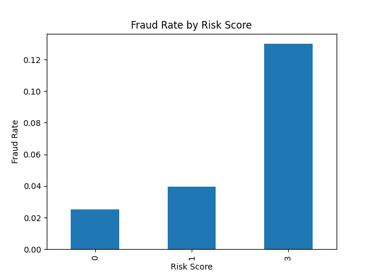

# Fraud Detection Analysis using SQL & Python

## Problem Statement
Fraud detection is challenging because fraudulent transactions are rare (~2.5%) and patterns are not obvious.  
This project focuses on identifying behavioral patterns in transaction data to detect high-risk fraud scenarios without using machine learning.

---

## What I Did
- Analyzed ~100K transaction records  
- Extracted time-based features from raw data  
- Studied fraud patterns across time and transaction amount  
- Built a rule-based fraud risk scoring system  

---

## Tools Used
- Python (Pandas, Matplotlib)  
- SQL  

---

## Dataset
- IEEE Fraud Detection Dataset (Kaggle)  
- Sampled subset used for analysis  

---

## Analysis Performed
- Fraud vs non-fraud comparison  
- Time-based fraud pattern analysis  
- Transaction amount distribution  
- Combined analysis of time + amount  

---

## Fraud Detection Approach
A rule-based scoring system was designed:

- **High Risk**
  - Transactions during peak fraud hours (8–9)
  - High transaction amount (>75th percentile)

- **Medium Risk**
  - Transactions during extended fraud hours (5–6, 8–9)
  - Moderate to high transaction amounts

**Risk Score Logic:**
- High Risk → 2  
- Medium Risk → 1  

---

## Key Insights
- Fraud is not dependent on transaction amount alone  
- Fraud activity varies significantly across time  
- Combining time and amount gives stronger detection signals  
- High-risk transactions show ~13% fraud rate vs ~2.5% baseline (~5x increase)  

---

## Results
- Low Risk → ~2.5% fraud rate  
- Medium Risk → ~4.9% fraud rate  
- High Risk → ~13% fraud rate  

---

## Business Impact
- High-risk transactions can be flagged for manual review or OTP verification  
- Monitoring peak fraud hours improves detection efficiency  
- Rule-based systems provide quick and interpretable fraud detection  

---

## Conclusion
This project demonstrates that strong data analysis and logical rule design can effectively identify fraud patterns without relying on machine learning models.
